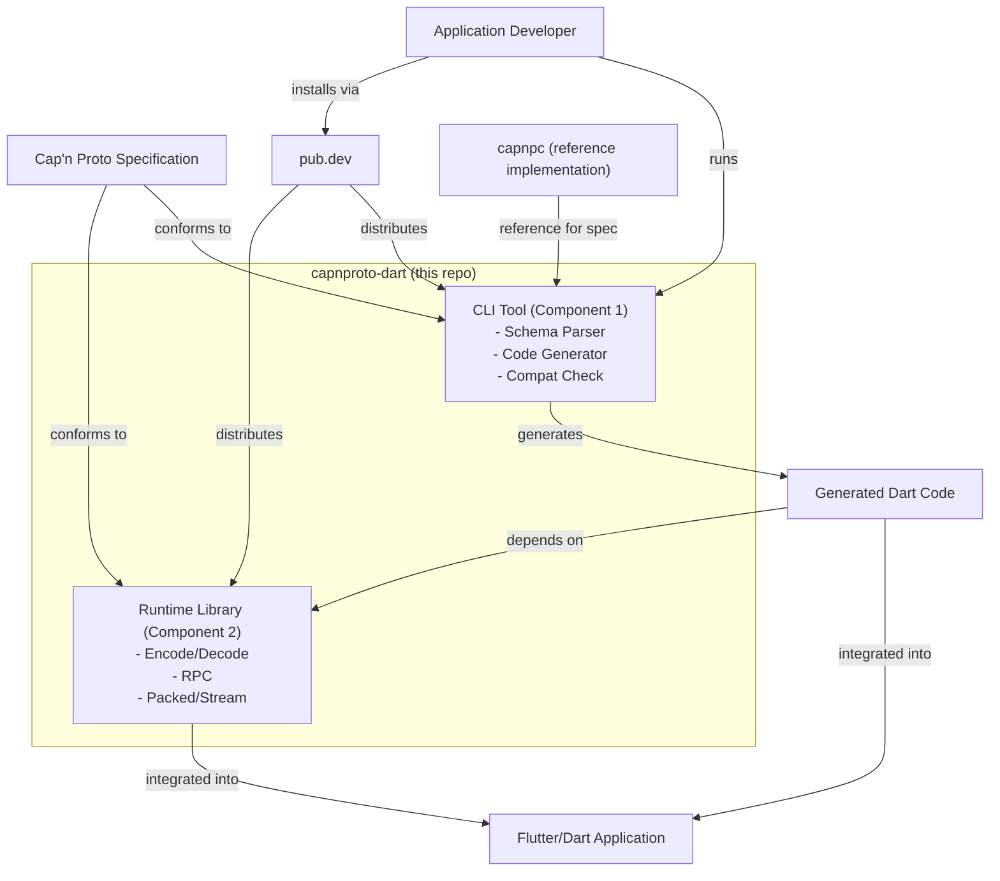

# Global Design

## Overview

This document describes the overall relationship between this repository and external systems.

## External Systems

| System | Role |
|---|---|
| **Cap'n Proto Specification** | Defines the binary encoding format and RPC protocol. Both components must conform to this specification. |
| **Application Developer** | Uses the CLI Tool to generate Dart code from schemas and integrates the Runtime Library into their Flutter/Dart application. |
| **Flutter/Dart Application** | The end product that embeds the Runtime Library and the generated Dart code. |
| **pub.dev** | The Dart package registry where both components are published and distributed. |
| **capnpc (reference implementation)** | The official Cap'n Proto compiler. Used as a reference for understanding schema syntax and binary format. No FFI dependency on it. |

## Relationship Diagram

## Component Responsibilities

### Component 1: CLI Tool (build-time)

- Accepts `.capnp` schema files as input.
- Parses schema files into an internal AST.
- Generates Dart source files from the AST.
- Verifies backward compatibility when schemas change.
- Used by the developer at build time, not shipped with the application.

### Component 2: Runtime Library (application-level)

- Provides encoding and decoding of Cap'n Proto binary messages.
- Implements Cap'n Proto RPC (client stubs and server skeletons).
- Supports packed encoding and streaming for large messages.
- Depended on by both the generated Dart code and the application directly.
- Published as a Dart package on pub.dev and shipped with the application.

## Notes

- The CLI Tool and Runtime Library reside in the same repository for now. They may be separated into individual repositories in the future if needed.
- `capnpc` is referenced for understanding the specification but is never called at runtime or linked via FFI.
