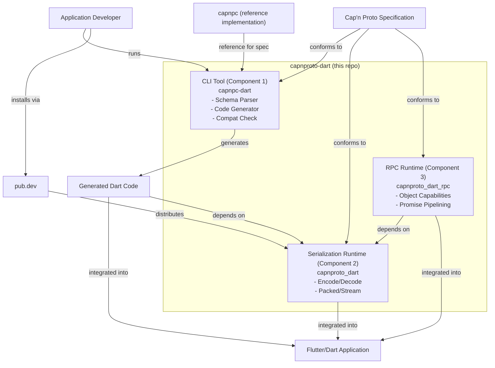

# Global Design

## Overview

This document describes the overall relationship between this repository and external systems.

## External Systems

| System | Role |
|---|---|
| **Cap'n Proto Specification** | Defines the binary encoding format and RPC protocol. All three components must conform to this specification. |
| **Application Developer** | Uses the CLI Tool to generate Dart code from schemas, links the Serialization Runtime for encoding/decoding, and optionally adds the RPC Runtime when RPC is needed. |
| **Flutter/Dart Application** | The end product that embeds the Serialization Runtime (and, if RPC is used, the RPC Runtime) plus the generated Dart code. |
| **pub.dev** | The Dart package registry. Currently only the Serialization Runtime (`capnproto_dart`) is published there; the CLI Tool and RPC Runtime have `publish_to: none` and are consumed within this repo. |
| **capnpc (reference implementation)** | The official Cap'n Proto compiler. Used as a reference for understanding schema syntax and binary format. No FFI dependency on it. |

## Relationship Diagram

## Component Responsibilities

### Component 1: CLI Tool (build-time)

- Accepts `.capnp` schema files as input.
- Parses schema files into an internal AST.
- Generates Dart source files from the AST.
- Verifies backward compatibility when schemas change.
- Used by the developer at build time, not shipped with the application.

### Component 2: Serialization Runtime (`capnproto_dart`, application-level)

- Provides encoding and decoding of Cap'n Proto binary messages.
- Supports packed encoding and streaming for large messages.
- Depended on by the generated Dart code, the RPC Runtime, and the application directly.
- Published as a Dart package on pub.dev and shipped with the application.

### Component 3: RPC Runtime (`capnproto_dart_rpc`, application-level, optional)

- Implements Cap'n Proto RPC (client stubs and server skeletons).
- Depends on the Serialization Runtime for message encoding.
- Only needed by applications that use RPC; not required for pure serialization use cases.
- Not yet published to pub.dev (`publish_to: none`); consumed as a path dependency within this repo.

## Notes

- The CLI Tool, Serialization Runtime, and RPC Runtime reside in the same repository for now. They may be separated into individual repositories in the future if needed.
- `capnpc` is referenced for understanding the specification but is never called at runtime or linked via FFI.
