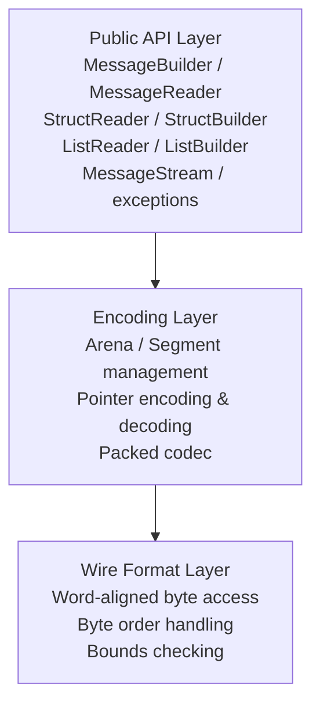
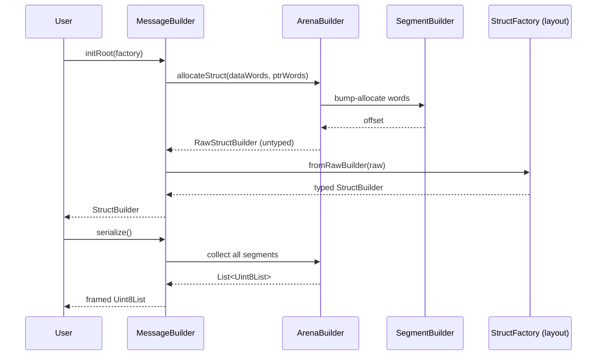
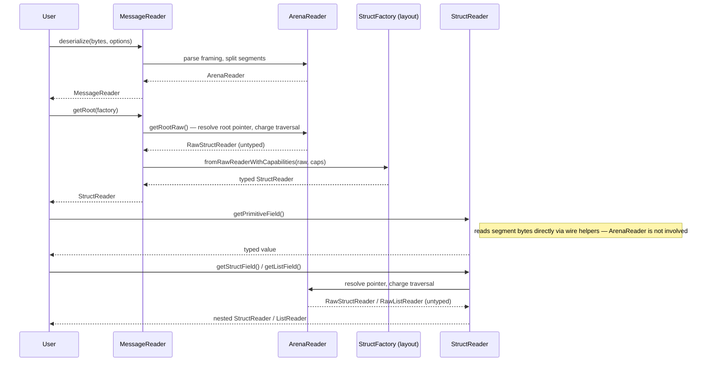
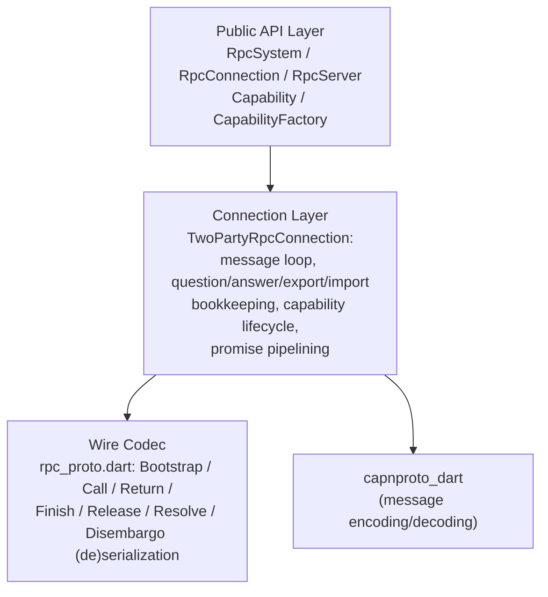
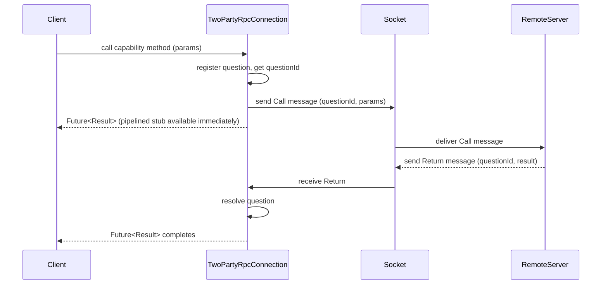

# Internal Design

This document describes the internal architecture of Component 2 (Serialization Runtime, `capnproto_dart`) and Component 3 (RPC Runtime, `capnproto_dart_rpc`). See [scope.md](scope.md) for the full three-component breakdown, including Component 1 (CLI Tool).

---

## Package Structure

```
capnproto-dart/
├── packages/
│   ├── capnproto_dart/         # Serialization Runtime (Component 2): encoding / decoding / streaming
│   └── capnproto_dart_rpc/     # RPC Runtime (Component 3): depends on capnproto_dart
└── tools/
    └── capnpc-dart/            # CLI Tool (Component 1): code generator plugin (language TBD)
```

---

## Component 2: Serialization Runtime (`capnproto_dart`)

### Layer Structure



### Module Layout

```
packages/capnproto_dart/
└── lib/
    ├── capnproto_dart.dart        # Public barrel export
    └── src/
        ├── message/
        │   ├── message_builder.dart
        │   ├── message_reader.dart
        │   ├── message_reader_options.dart
        │   └── message_copy.dart   # Deep-copy / canonicalization helpers
        ├── arena/
        │   ├── arena_builder.dart  # Manages writable segments; grows on demand
        │   ├── arena_reader.dart   # Manages readable segments
        │   ├── segment_builder.dart
        │   └── segment_reader.dart
        ├── layout/
        │   ├── struct_reader.dart
        │   ├── struct_builder.dart
        │   ├── list_reader.dart
        │   ├── list_builder.dart
        │   ├── struct_factory.dart
        │   └── any_pointer.dart    # Schema-less (dynamic) AnyPointer read/write
        ├── schema/
        │   └── reflection.dart     # Generated schema metadata (SchemaInfo) for runtime reflection
        ├── wire/
        │   ├── wire_helpers.dart   # Low-level read/write on word-aligned ByteData
        │   └── pointer.dart        # Pointer kind, encoding, and decoding
        ├── stream/
        │   ├── packed_codec.dart   # Packed encoding / decoding
        │   └── message_stream.dart # Framing multiple messages over a byte stream
        └── exception/
            ├── capnp_exception.dart
            ├── decode_exception.dart
            └── schema_exception.dart
```

### Key Design Patterns

#### Arena Allocation
`MessageBuilder` owns an `ArenaBuilder` that manages one or more `SegmentBuilder`s.
New objects are bump-allocated within the current segment; a new segment is added when the current one is full.
This avoids fragmentation and makes serialization a simple concatenation of segments.

#### Lazy Traversal with Traversal Limit
`StructReader` and `ListReader` do not decode data eagerly.
Each field access traverses exactly one pointer step, decrementing the remaining traversal budget held in `ArenaReader`.
When the budget reaches zero, a `DecodeException` is thrown.
This guards against amplification attacks with minimal overhead.

#### Pointer Resolution
All pointer types (struct, list, far, capability) are resolved in `wire/pointer.dart`.
Far pointers transparently redirect traversal to another segment,
keeping all higher-level code segment-agnostic.

#### Dynamic Reflection (AnyPointer + SchemaInfo)
`capnpc-dart` emits a `const SchemaInfo` (`schema/reflection.dart`) describing each
generated struct/enum/interface, exposed via `StructFactory.schema`.
`layout/any_pointer.dart` uses this metadata to give schema-less read/write access to
`AnyPointer` fields (`AnyPointerReader`/`AnyPointerBuilder`, backed by
`DynamicStructReader`/`DynamicStructBuilder`/`DynamicListReader`/`DynamicListBuilder`),
for cases where the concrete type isn't known at compile time — most notably the RPC
layer resolving `Payload.content`.

### Data Flow: Encoding



### Data Flow: Decoding



---

## Component 3: RPC Runtime (`capnproto_dart_rpc`)

### Layer Structure



### Module Layout

```
packages/capnproto_dart_rpc/
└── lib/
    ├── capnproto_dart_rpc.dart    # Public barrel export (re-exports capnproto_dart)
    └── src/
        ├── capability/
        │   ├── capability.dart               # Capability, DispatchContext/Result, CapCall,
        │   │                                  # pipelined/null/deferred capability stubs
        │   ├── capability_factory.dart
        │   └── capability_any_pointer_codec.dart
        └── rpc/
            ├── rpc_system.dart          # RpcSystem.connect/serve — TCP transport (dart:io Socket)
            ├── rpc_server.dart
            ├── rpc_exception.dart
            ├── rpc_proto.dart           # Wire codec for RPC messages (Call/Return/Resolve/...)
            ├── flow_controller.dart     # Fixed-window streaming backpressure
            └── two_party_connection.dart  # TwoPartyRpcConnection: message loop, all four
                                            # tables, and capability lifecycle
```

### Key Design Patterns

#### Four-Table Model
Each RPC connection tracks the lifecycle of capabilities and calls via four logical tables:
- **Questions**: outgoing calls waiting for a `Return` message
- **Answers**: incoming calls being handled by the local server
- **Exports**: local capabilities sent to the remote peer (ref-counted)
- **Imports**: remote capabilities received from the peer (ref-counted)

These are not separate classes — they are private state (e.g. `_ExportEntry`,
`_ImportState`, and question/answer tracking maps) held directly inside the single
`TwoPartyRpcConnection` class, which owns the message loop end-to-end. This follows the
Cap'n Proto Level 1 RPC specification (two-party subset; Resolve/Disembargo sending is
not implemented).

#### Promise Pipelining via Dart Futures
When a client sends a `Call` whose return value is a `Capability`,
the runtime immediately creates a pipelined `Capability` stub backed by the pending `Future`.
Subsequent calls on this stub are queued locally and forwarded to the server in a single
network round-trip once the original `Return` arrives.

#### Transport
`TwoPartyRpcConnection` operates directly on a raw `Stream<Uint8List>` /
`StreamSink<Uint8List>` pair (via its `.client()` / `.server()` factories) — there is no
`VatNetwork`-style pluggable transport interface. `RpcSystem.connect`/`serve` hardcode a
`tcp://` transport by wrapping `dart:io` `Socket`/`ServerSocket` directly. Callers who
need a different transport (e.g. in-process pipes for testing) construct a
`TwoPartyRpcConnection` directly instead of going through `RpcSystem`.

### Data Flow: RPC Call



---

## Cross-Cutting Concerns

### Error Handling Strategy
- All public methods throw subclasses of `CapnpException` on failure.
- Internal helpers use `CapnpException` directly; higher layers wrap with more specific subtypes.
- No error is silently swallowed.

### Immutability
- `StructReader`, `ListReader`, and `MessageReader` are immutable views.
- `StructBuilder`, `ListBuilder`, and `MessageBuilder` are mutable and must not be shared across isolates.

### Testing Strategy
- Wire format layer: property-based tests against the Cap'n Proto binary encoding specification.
- Encoding layer: round-trip tests (encode → decode → compare) for all primitive and composite types.
- RPC layer: in-process transport (`VatNetwork` stub) used for all protocol-level tests without a real network.
