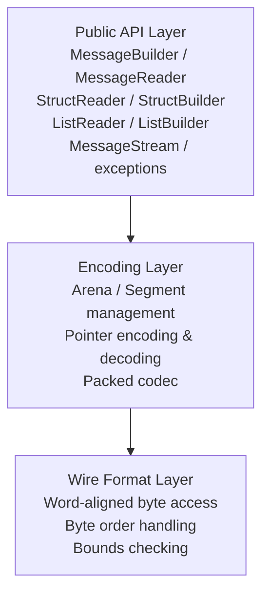
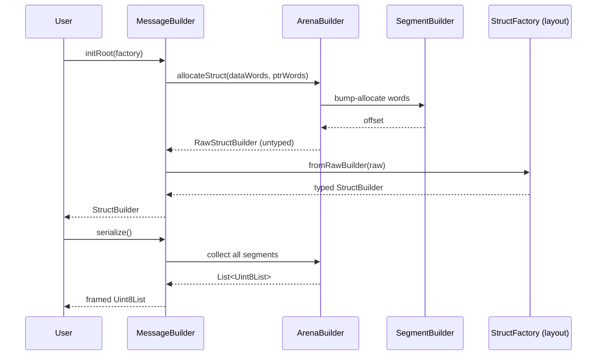
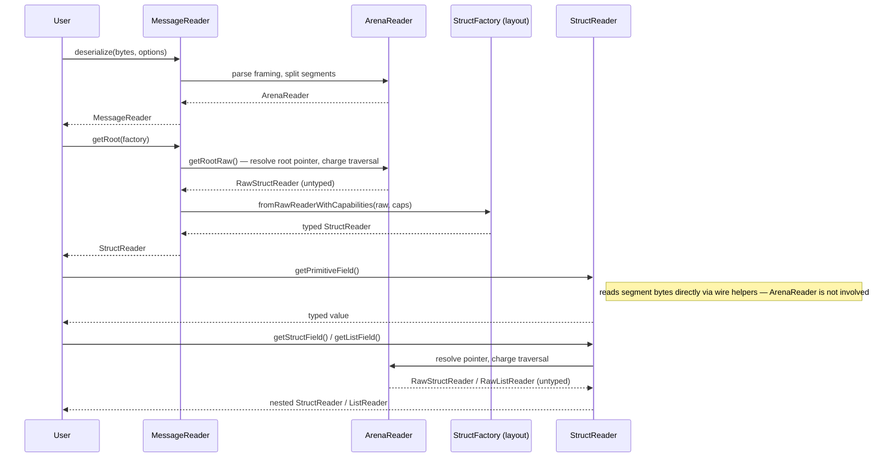

# Internal Design: Serialization Runtime (`capnproto_dart`)

## Layer Structure



## Module Layout

```
packages/capnproto_dart/
└── lib/
    ├── capnproto_dart.dart        # Public barrel export
    └── src/
        ├── message/
        │   ├── message_builder.dart
        │   ├── message_reader.dart
        │   ├── message_reader_options.dart
        │   └── message_copy.dart   # Deep-copy / canonicalization helpers
        ├── arena/
        │   ├── arena_builder.dart  # Manages writable segments; grows on demand
        │   ├── arena_reader.dart   # Manages readable segments
        │   ├── segment_builder.dart
        │   └── segment_reader.dart
        ├── layout/
        │   ├── struct_reader.dart
        │   ├── struct_builder.dart
        │   ├── list_reader.dart
        │   ├── list_builder.dart
        │   ├── struct_factory.dart
        │   └── any_pointer.dart    # Schema-less (dynamic) AnyPointer read/write
        ├── schema/
        │   └── reflection.dart     # Generated schema metadata (SchemaInfo) for runtime reflection
        ├── wire/
        │   ├── wire_helpers.dart   # Low-level read/write on word-aligned ByteData
        │   └── pointer.dart        # Pointer kind, encoding, and decoding
        ├── stream/
        │   ├── packed_codec.dart   # Packed encoding / decoding
        │   └── message_stream.dart # Framing multiple messages over a byte stream
        └── exception/
            ├── capnp_exception.dart
            ├── decode_exception.dart
            └── schema_exception.dart
```

## Key Design Patterns

### Arena Allocation
`MessageBuilder` owns an `ArenaBuilder` that manages one or more `SegmentBuilder`s.
New objects are bump-allocated within the current segment; a new segment is added when the current one is full.
This avoids fragmentation and makes serialization a simple concatenation of segments.

### Lazy Traversal with Traversal Limit
`StructReader` and `ListReader` do not decode data eagerly.
Each field access traverses exactly one pointer step, decrementing the remaining traversal budget held in `ArenaReader`.
When the budget reaches zero, a `DecodeException` is thrown.
This guards against amplification attacks with minimal overhead.

### Pointer Resolution
All pointer types (struct, list, far, capability) are resolved in `wire/pointer.dart`.
Far pointers transparently redirect traversal to another segment,
keeping all higher-level code segment-agnostic.

### Dynamic Reflection (AnyPointer + SchemaInfo)
`capnpc-dart` emits a `const SchemaInfo` (`schema/reflection.dart`) describing each
generated struct/enum/interface, exposed via `StructFactory.schema`.
`layout/any_pointer.dart` uses this metadata to give schema-less read/write access to
`AnyPointer` fields (`AnyPointerReader`/`AnyPointerBuilder`, backed by
`DynamicStructReader`/`DynamicStructBuilder`/`DynamicListReader`/`DynamicListBuilder`),
for cases where the concrete type isn't known at compile time — most notably the RPC
layer resolving `Payload.content`.

## Data Flow: Encoding



## Data Flow: Decoding



## Cross-Cutting Concerns

### Error Handling Strategy
- All public methods throw subclasses of `CapnpException` on failure.
- Internal helpers use `CapnpException` directly; higher layers wrap with more specific subtypes.
- No error is silently swallowed.
- `CapnpException` is the base class shared with the RPC Runtime — see
  [`capnproto_dart_rpc`'s internal design](pathname:///capnproto_dart_rpc/internal-design#error-handling-strategy)
  for how `RpcException` builds on it.

### Immutability
- `StructReader`, `ListReader`, and `MessageReader` are immutable views.
- `StructBuilder`, `ListBuilder`, and `MessageBuilder` are mutable and must not be shared across isolates.

### Testing Strategy
- Wire format layer: property-based tests against the Cap'n Proto binary encoding specification.
- Encoding layer: round-trip tests (encode → decode → compare) for all primitive and composite types.
