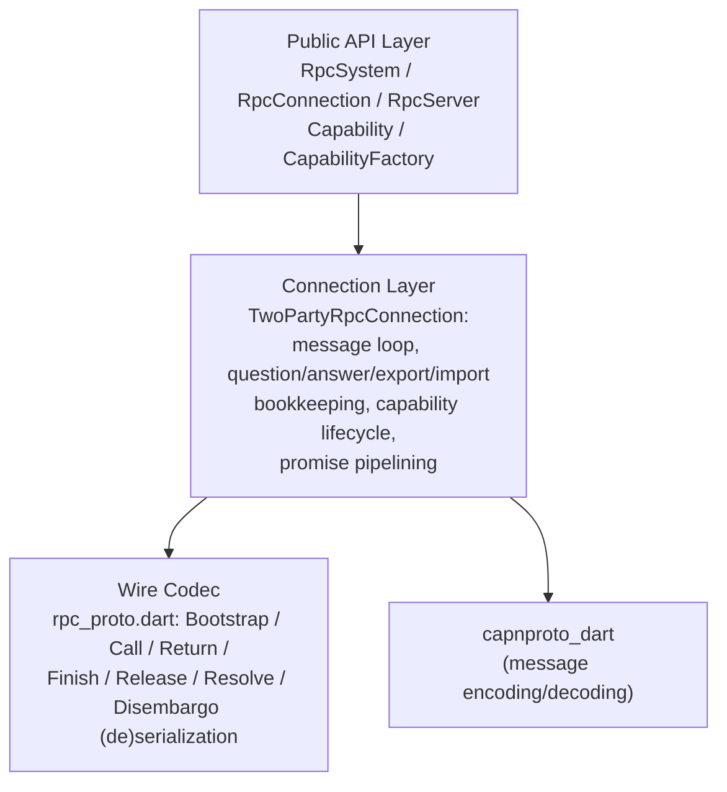
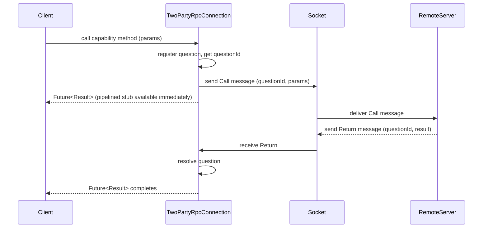

# Internal Design: RPC Runtime (`capnproto_dart_rpc`)

## Layer Structure



## Module Layout

```
packages/capnproto_dart_rpc/
└── lib/
    ├── capnproto_dart_rpc.dart    # Public barrel export (re-exports capnproto_dart)
    └── src/
        ├── capability/
        │   ├── capability.dart               # Capability, DispatchContext/Result, CapCall,
        │   │                                  # pipelined/null/deferred capability stubs
        │   ├── capability_factory.dart
        │   └── capability_any_pointer_codec.dart
        └── rpc/
            ├── rpc_system.dart          # RpcSystem.connect/serve — TCP transport (dart:io Socket)
            ├── rpc_server.dart
            ├── rpc_exception.dart
            ├── rpc_proto.dart           # Wire codec for RPC messages (Call/Return/Resolve/...)
            ├── flow_controller.dart     # Fixed-window streaming backpressure
            └── two_party_connection.dart  # TwoPartyRpcConnection: message loop, all four
                                            # tables, and capability lifecycle
```

## Key Design Patterns

### Four-Table Model
Each RPC connection tracks the lifecycle of capabilities and calls via four logical tables:
- **Questions**: outgoing calls waiting for a `Return` message
- **Answers**: incoming calls being handled by the local server
- **Exports**: local capabilities sent to the remote peer (ref-counted)
- **Imports**: remote capabilities received from the peer (ref-counted)

These are not separate classes — they are private state (e.g. `_ExportEntry`,
`_ImportState`, and question/answer tracking maps) held directly inside the single
`TwoPartyRpcConnection` class, which owns the message loop end-to-end. This follows the
Cap'n Proto Level 1 RPC specification (two-party subset; Resolve/Disembargo sending is
not implemented).

### Tail Calls
`Capability.tryTailCall` is checked in `_dispatchToCapability` before running a normal
dispatch. When the target is a same-connection `_ImportedCapability` (i.e. it lives back
on the very peer that sent the call being answered), the connection forwards a new `Call`
to that peer (flagged `sendResultsTo=yourself`) and immediately answers the original
question with `Return.takeFromOtherQuestion`, without registering it in the Answers
table (`_answerCaps`/`_pendingCaps`) — so pipelining further on that original question is
deliberately unsupported (see `doc/external-spec.md`). The peer correlates the redirect
entirely from its own Answers table: `_awaitReturn` resolves `takeFromOtherQuestion` by
looking up its own `_answerCaps`/`_pendingCaps` for the forwarded call's question id — no
extra wire round trip. When the target isn't a same-connection import, the runtime falls
back to a normal dispatch against it (`_runDispatch`), answering the original question the
usual way.

When this vat receives a forwarded `Call` with `sendResultsTo=yourself`, `_answerCaps`
stores the completed result only as a local rendezvous point for
`Return.takeFromOtherQuestion`. That table entry does not own the result capabilities:
`_awaitReturn()` transfers those same capability references to the original local caller's
`DispatchResult`, and the forwarded question is later finished with
`releaseResultCaps=false`. Therefore `Finish` for that forwarded question drops only the
answer bookkeeping; it must not dispose the result capabilities.

### Promise Pipelining via Dart Futures
When a client sends a `Call` whose return value is a `Capability`,
the runtime immediately creates a pipelined `Capability` stub backed by the pending `Future`.
Subsequent calls on this stub are queued locally and forwarded to the server in a single
network round-trip once the original `Return` arrives.

### Transport
`TwoPartyRpcConnection` operates directly on a raw `Stream<Uint8List>` /
`StreamSink<Uint8List>` pair (via its `.client()` / `.server()` factories) — there is no
`VatNetwork`-style pluggable transport interface. `RpcSystem.connect`/`serve` hardcode a
`tcp://` transport by wrapping `dart:io` `Socket`/`ServerSocket` directly. Callers who
need a different transport (e.g. in-process pipes for testing) construct a
`TwoPartyRpcConnection` directly instead of going through `RpcSystem`.

Note also that `TwoPartyRpcConnection` does not spawn an isolate: the whole message loop
(`_runMessageLoop`, `.listen()` on the incoming byte stream) and every `Call` dispatch
(including server-initiated calls into a locally-implemented capability) run on the same
isolate that created the connection, driven by the normal Dart event loop. Offloading
heavy work triggered by an incoming call onto another isolate is left to the capability
implementation (e.g. call `Isolate.run`/`compute` inside the overridden dispatch method);
the library itself has no separate-isolate transport mode.

## Data Flow: RPC Call



## Cross-Cutting Concerns

### Error Handling Strategy
- All public methods throw subclasses of `CapnpException` on failure; `RpcException`
  extends it (see [`capnproto_dart`'s internal design](pathname:///capnproto_dart/internal-design#error-handling-strategy)
  for the base error-handling strategy shared across both runtimes).
- No error is silently swallowed.

### Testing Strategy
- In-process transport (`VatNetwork` stub) used for all protocol-level tests without a real network.
